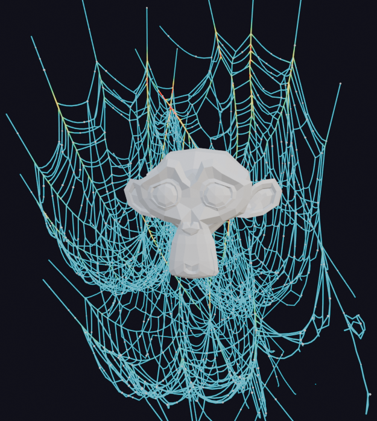
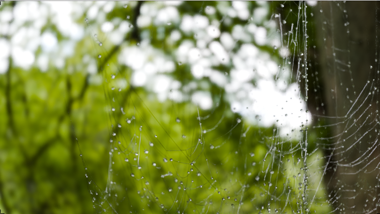

# procedural-cobwebs-generator
Blender Procedural CobWeb with Tearing Solver

Generator procedural cobwebs (radials, spiral, anchors) with pins, pre-written into the swf_pin attribute

Solver custom verlet/PBD Simulation-Zone solver with gravity, wind + turbulence, collision, friction, and TEARING

Strandify silk tubes with noisy radius, Fresnel silk material, optional dew droplets *dew has bug generating each frame

QUICK START

1. (Optional) select a mesh to use as the collider.

2. N-panel > Web Forge > "Generate Web + Add GPU Solver + Strandify".

3. Rewind to frame 1 and press play. Push the collider through the web.

Notes: sim runs in the web object's local space (keep it un-rotated or
rotate the Gravity input); colliders need faces; raise Substeps for fast
colliders; bake via Physics properties > Simulation Nodes.

Blender 5.2+

